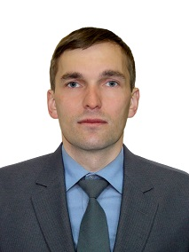

# Немного о себе

*Это я*

## Раньше

Познакомился с программированием ещё в школе, дальше учился в МИРЭА, и там изучал Паскаль. Потом надолго расстался с программированием, хотя по жизни приходилось решать задачи так или иначе с ним связанные. Полученные навыки пригодились. Вообще программировать нравиться.

## Сейчас

Сейчас прохожу курсы Fullstack-разработчик на Нетологии.

## Недалёкое будущее

В дальнешем планирую подработывать на фрилансе, и в зависимости от успехов сменить профессию на профессию в сфере IT.